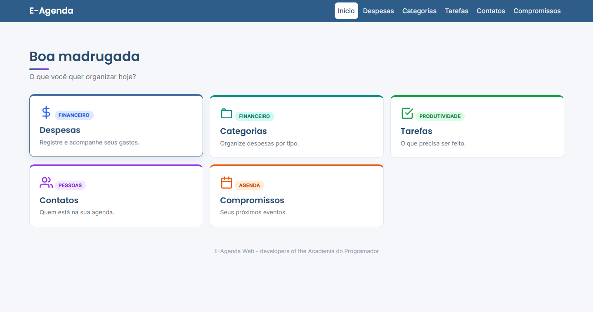
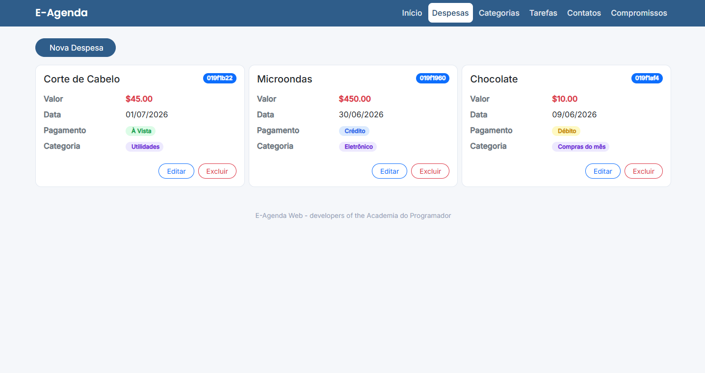

# 📅 E-Agenda Web

<p align="center">
  Sistema web desenvolvido em <strong>ASP.NET Core MVC</strong> para gerenciamento de informações pessoais, reunindo em uma única plataforma o controle de contatos, compromissos, tarefas, categorias e despesas.
</p>

<p align="center">
  
  
  
  
  
</p>

---

## 📖 Sobre o Projeto

O **E-Agenda Web** é uma aplicação desenvolvida em **ASP.NET Core MVC** com o objetivo de centralizar o gerenciamento de informações pessoais em uma interface simples, organizada e responsiva.

A aplicação permite administrar contatos, compromissos, tarefas e despesas, oferecendo funcionalidades completas de cadastro, consulta, edição e exclusão de registros.

Durante o desenvolvimento foram aplicados conceitos de arquitetura em camadas, separação de responsabilidades e boas práticas de desenvolvimento utilizando o ecossistema .NET.

---

## ✨ Funcionalidades

### 👤 Contatos

- Cadastro de contatos
- Edição de registros
- Exclusão
- Consulta de detalhes
- Listagem completa

### 📅 Compromissos

- Cadastro de compromissos
- Alteração de informações
- Exclusão
- Visualização detalhada
- Organização por data

### ✅ Tarefas

- Cadastro de tarefas
- Adição de itens
- Marcação de conclusão
- Percentual de progresso
- Filtro por tarefas pendentes e concluídas

### 💰 Despesas

- Cadastro de despesas
- Associação com categorias
- Consulta detalhada
- Edição e exclusão

### 🏷️ Categorias

- Cadastro
- Alteração
- Exclusão
- Visualização das despesas relacionadas

---

## 🏛️ Arquitetura

O projeto foi desenvolvido seguindo o padrão **MVC (Model-View-Controller)** e organizado em camadas para promover desacoplamento e facilitar a manutenção da aplicação.

```
Apresentação (ASP.NET Core MVC)
        │
        ▼
     Aplicação
        │
        ▼
      Domínio
        │
        ▼
   Infraestrutura
        │
        ▼
    SQL Server
```

---

## 🛠️ Tecnologias Utilizadas

| Tecnologia | Descrição |
|------------|-----------|
| ASP.NET Core MVC | Framework Web |
| C# | Linguagem de programação |
| Razor (CSHTML) | Engine de Views |
| Entity Framework Core | ORM |
| AutoMapper | Mapeamento entre objetos |
| SQL Server | Banco de dados |
| Bootstrap 5 | Interface Responsiva |
| HTML5 | Estrutura das páginas |
| CSS3 | Estilização |

---

## 🏗️ Arquitetura

```text
E-Agenda.WebApp
│
├── Compartilhado
│   ├── Aplicação
│   ├── Apresentação
│   ├── Domínio
│   └── Infraestrutura
│
└── Módulos
    ├── ModuloCategoria
    ├── ModuloCompromisso
    ├── ModuloContato
    ├── ModuloDespesa
    └── ModuloTarefa
```

A aplicação foi organizada utilizando uma **arquitetura modular**, em que cada módulo representa um contexto de negócio independente. Além disso, os componentes reutilizáveis são centralizados na pasta **Compartilhado**, promovendo separação de responsabilidades, reutilização de código e facilidade de manutenção.

---

## 🚀 Como Executar

### 1. Clone o repositório

```bash
git clone https://github.com/seu-usuario/E-Agenda.git
```

### 2. Acesse a pasta do projeto.

```bash
cd E-Agenda.WebApp
```

### 3. Restaure as dependências.

```bash
dotnet restore
```

### 4. Execute as migrations (caso necessário).

```bash
dotnet ef database update
```

### 5. Inicie a aplicação.

```bash
dotnet run
```

---

## 📸 Demonstração

### Tela Inicial

<p align="center">

</p>

### Controle de Despesas

<p align="center">

</p>

---

## 📚 Conceitos Aplicados

- Arquitetura em Camadas
- ASP.NET Core MVC
- Entity Framework Core
- AutoMapper
- Injeção de Dependência
- Repository Pattern
- DTOs
- Validações
- Boas práticas de orientação a objetos

---

<div align="center">

## 👨‍💻 Desenvolvedores

**Dayuã Santana** • **Iago Pereira**

Projeto desenvolvido durante a **Academia do Programador** utilizando **ASP.NET Core MVC**, **Entity Framework Core**, **SQL Server** e **Bootstrap 5**.

</div>